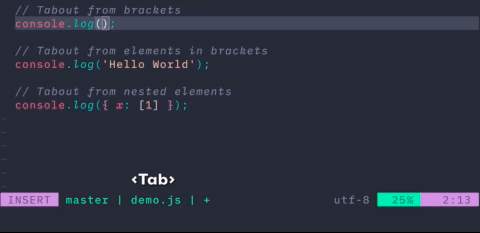

# 🦿 tabout.nvim

Supercharge your workflow and start tabbing out from parentheses, quotes, and
similar contexts today.



<p>&nbsp;</p>

## 💡 examples

| Before           | Key       | After               | Setting                                        |
| ---------------- | --------- | ------------------- | ---------------------------------------------- |
| `{ \| }`         | `<Tab>`   | `{} \| `            | -                                              |
| `{ \|"string" }` | `<Tab>`   | `{ "string"\| } `   | `ignore_beginning = true`                      |
| `{ \|"string" }` | `<Tab>`   | `{ ....\|"string"}` | `ignore_beginning = false, act_as_tab = true,` |
| `{ "string"\| }` | `<S-Tab>` | `{ \|"string" } `   | -                                              |
| `\|#[macro_use]` | `<Tab>`   | `#[macro_use]\| `   | `tabouts = {{open = '#', close = ']'}}`        |

<p>&nbsp;</p>

## 📦 requirements

- [nvim](https://neovim.io/) >= 0.5
- [nvim-treesitter](https://github.com/nvim-treesitter/nvim-treesitter)
<p>&nbsp;</p>

## 💾 installation

### [packer](https://github.com/wbthomason/packer.nvim)

```lua
-- Lua
use {
  'abecodes/tabout.nvim',
  config = function()
    require('tabout').setup {
    tabkey = '<Tab>', -- key to trigger tabout
    backwards_tabkey = '<S-Tab>', -- key to trigger backwards tabout
    act_as_tab = true, -- shift content if tab out is not possible
    act_as_shift_tab = false, -- reverse shift content if tab out is not possible (if your keyboard/terminal supports <S-Tab>)
    completion = true, -- if the tabkey is used in a completion pum
    tabouts = {
      {open = "'", close = "'"},
      {open = '"', close = '"'},
      {open = '`', close = '`'},
      {open = '(', close = ')'},
      {open = '[', close = ']'},
      {open = '{', close = '}'}
    },
    ignore_beginning = true, --[[ if the cursor is at the beginning of a filled element it will rather tab out than shift the content ]]
    exclude = {} -- tabout will ignore these filetypes
}
  end,
	wants = {'nvim-treesitter'}, -- or require if not used so far
	after = {'completion-nvim'} -- if a completion plugin is using tabs load it before
}
```

If you use another plugin manager just make sure `tabout.nvim` is loaded after
`nvim-treesitter` and any completion that already uses your _tabKey_.

<p>&nbsp;</p>

## 🛠️ options

### tabKey

Set the key you want to use to trigger tabout.

```lua
-- default
tabKey = '<Tab>'
```

### tabShiftKey

Set the key you want to use to trigger tabout backwards.

```lua
-- default
tabShiftKey = '<S-Tab>'
```

### backwards_tabkey

Set the key you want to use to trigger tabout backwards.

```lua
-- default
backwards_tabkey = '<S-Tab>'
```

### act_as_tab

If a tab out is not possible shift the content.

```lua
-- default
act_as_tab = true
```

### act_as_shift_tab

If a backwards tab out is not possible reverse shift the content. (Depends on keyboard/terminal if it will work)

```lua
-- default
act_as_shift_tab = false
```

### completion

If you use a completion _pum_ that also uses the tab key for a smart scroll
function. Setting this to true will disable tab out when the _pum_ is open and
execute the smart scroll function instead.

```lua
-- default
completion = true
```

### tabouts

Here you can add more symbols you want to tab out from.

**open an close can only contain one character for now**

```lua
-- default
tabouts = {
  {open = "'", close = "'"},
  {open = '"', close = '"'},
  {open = '`', close = '`'},
  {open = '(', close = ')'},
  {open = '[', close = ']'},
  {open = '{', close = '}'}
}
```

### ignore_beginning

If set to true you can also tab out from the beginning of a string, object
property, etc.

```lua
-- default
ignore_beginning = true
```

<p>&nbsp;</p>

## 📋 commands

| command      | triggers                                     |
| ------------ | -------------------------------------------- |
| Tabout       | trys to tab out of current context           |
| TaboutBack   | trys to tab out backwards of current context |
| TaboutToggle | (de)activates the plugin                     |

<p>&nbsp;</p>

## ⚠️ exceptions

`tabout.nvim` only works with
[nvim-treesitter's supported filetypes](https://github.com/nvim-treesitter/nvim-treesitter#supported-languages).

Right now it is only possible to tab out if the tabout is on the same line.

<p>&nbsp;</p>

## ✅ todo

- [ ] tabout in blockcomment strings
- [ ] allow multi line tabout
- [ ] support multi character tabouts
